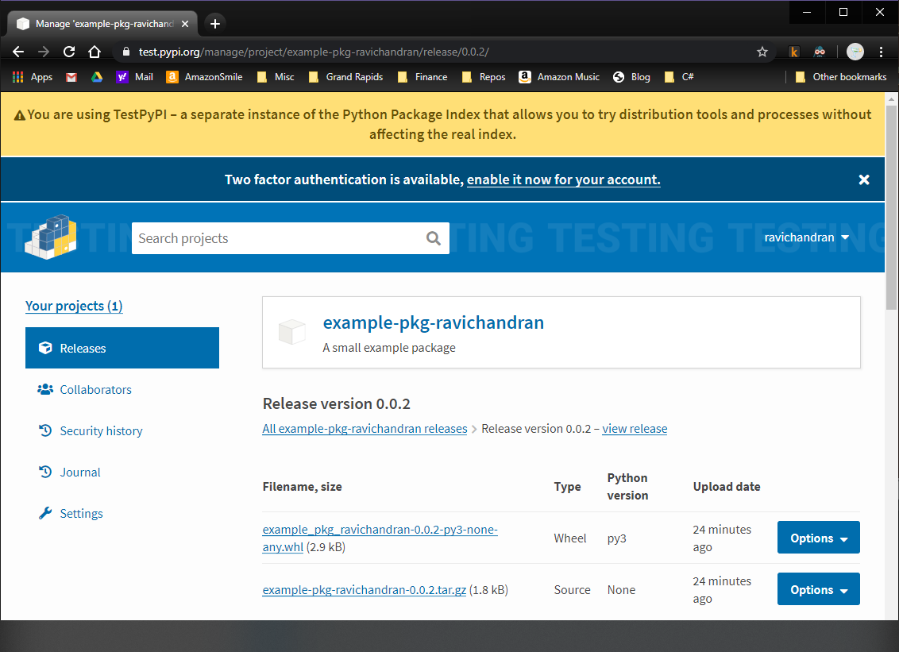

# Python Packaging Tutorial
This is based on the [Python packaging tutorial](https://packaging.python.org/tutorials/packaging-projects/). However, that tutorial does not explain the use of `~/.pypirc` for authentication setup. If you do set up a `~/.pypirc` but follow that tutorial, you may still get prompted for username and password when you try to perform a `twine upload`. So here are the abbreviated steps for the tutorial using a properly configured `~/.pypirc`.

The steps here are for Windows 10 since it's always a little more painful on Windows than Linux... grumble grumble.

Here's a view of the end result after following these steps:



## Install Required Tools
Since these tools are valuable across projects, I'm not installing them in a virtual environment.

- Install [Python 3](https://www.python.org/downloads/)

- Upgrade `pip` to avoid annoying warnings about upgrading `pip`
```bat
python -m pip install --upgrade pip
```

- Install/upgrade to latest versions of `setuptools`, `wheel` and `twine`
```bat
python -m pip install --upgrade setuptools wheel twine
```


## Set Up `.pypirc` For Authentication to TestPyPI and PyPI
- Set up an account and create an API token for [TestPyPI](https://test.pypi.org/manage/projects/)

- Set up an account and create an API token for [PyPI](https://pypi.org/account/register/)

- Under Windows, create `.pypirc` file in your home folder which is usually `C:\Users\YourUserName`. You can get your home folder path using one of the following:
```bat
echo %homepath%
echo %userprofile%
```

- Here's the format for the `~/.pypirc` file if you're using the API tokens. I learned about this from this good [article](https://truveris.github.io/articles/configuring-pypirc/). You could also use the username and password instead of API tokens.

```ini
[distutils]
index-servers=
    pypi
    testpypi

[pypi]
username: __token__
password: my_pypi_api_token

[testpypi]
repository: https://test.pypi.org/legacy/
username: __token__
password: my_testpypi_api_token
```

## Building And Publishing Your Package To TestPyPI
- Run this command from the same directory where `setup.py` is located:
```bat
python setup.py sdist bdist_wheel
```

- Run Twine to upload all of the archives under `dist`:
```bat
python -m twine upload --repository testpypi dist/*
```

## What Won't Work
Note that both the following approaches will prompt for username and password. It's unclear why the [`twine` upload options](https://github.com/pypa/twine#options) seem to ignore the `--config-file` option when used with `--repository-url`.
```bat
python -m twine upload --repository-url https://test.pypi.org/legacy/ dist/*
python -m twine upload --config-file C:\Users\RC\.pypirc --repository-url https://test.pypi.org/legacy/ dist/*
```

- Alternative that does work with the `--repository-url` option. But you have to specify your username and password on the command line:
```bat
python -m twine upload --username ravichandran --password xxxxxxx --repository-url https://test.pypi.org/legacy/ dist/*
```

## Install Uploaded Package And Test It
- Let's install the package in a virtual environment. Ensure you do it in some other file path, not inside this tutorial folder as the package already exists here.

```bat
cd D:\repos\somewhere_else
python -m venv venv1
venv1\Scripts\activate.bat
python -m pip install --index-url https://test.pypi.org/simple/ --no-deps example-pkg-ravichandran
```

- When the last line above is executed, `pip` installs from TestPyPI:
```
Looking in indexes: https://test.pypi.org/simple/
Collecting example-pkg-ravichandran
  Downloading https://test-files.pythonhosted.org/packages/29/c2/f4e1309f361b19f01868af261220c0da8bc8820da4325bccd1b7e1a26480/example_pkg_ravichandran-0.0.2-py3-none-any.whl
Installing collected packages: example-pkg-ravichandran
Successfully installed example-pkg-ravichandran-0.0.2
```

- Run `python`, and `import example_pkg`. No errors indicates that it worked.

## Production Notes
- No need to append username to the package name in `setup.py`
- `twine upload dist/*` will upload to PyPI (no need to specify `--repository-url`)
